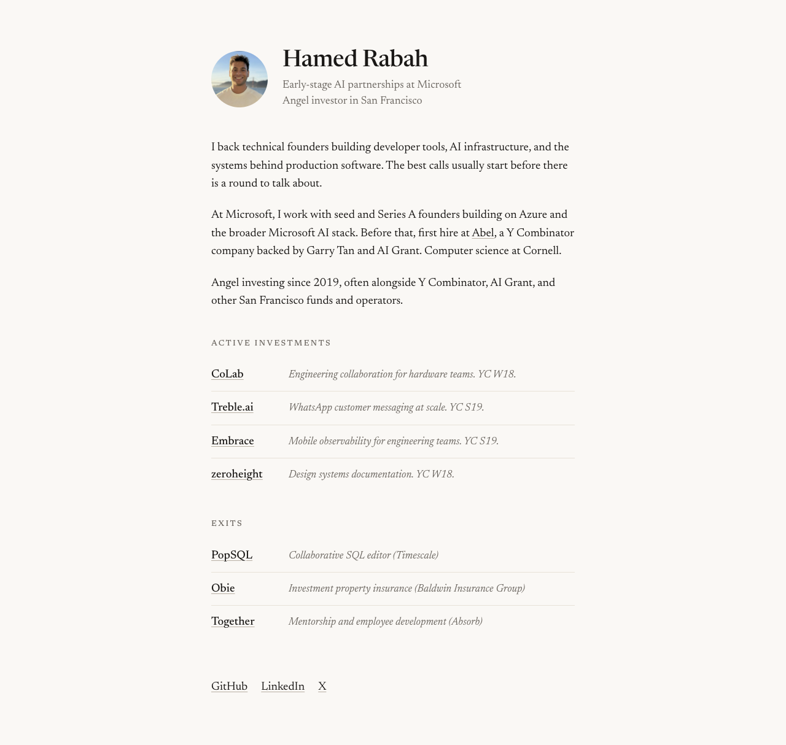

# Hamed Rabah

Source for [hamedrabah.github.io](https://hamedrabah.github.io/), my personal site about early-stage AI partnerships, angel investing, and the technical founders I work with in San Francisco.

[](https://hamedrabah.github.io/)
[](https://github.com/hamedrabah/hamedrabah.github.io/deployments)



## Why it is built this way

This site should read like a page, not a product demo. The implementation is deliberately thin: semantic HTML, a small CSS system, no client-side JavaScript, and no build chain. It stays fast, portable, and easy to inspect.

## Under the hood

| | |
| --- | --- |
| Rendering | Static HTML and CSS |
| Hosting | GitHub Pages from `master` |
| Typography | Newsreader with system serif fallbacks |
| Metadata | Canonical URL, Open Graph, Twitter Card, and Person JSON-LD |
| Accessibility | Skip link, semantic landmarks, keyboard focus states, and alt text |
| Runtime dependencies | None |

## Run it locally

Serve the repository over HTTP so the browser loads it the same way as GitHub Pages:

```sh
python3 -m http.server 8000
```

Then open [http://localhost:8000](http://localhost:8000).

## Deploy

GitHub Pages publishes the root of `master` at [hamedrabah.github.io](https://hamedrabah.github.io/). A push to that branch starts a new deployment.

## License

The work in this repository is available under the [Creative Commons Attribution 3.0 license](LICENSE.txt).
